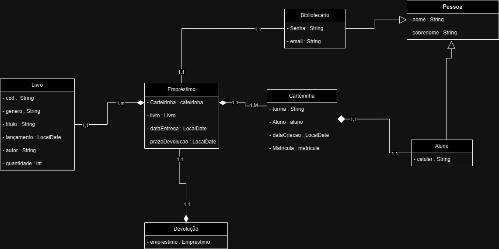

# Banco de Dados

## Banco de Dados vs SGBD
Um banco de dados armazena as informações, não dependente de tecnologia. Já um sistema de gerenciamento serve para manipular as informações, compartilhar, analisar etc. 

_Para o curso será utilizado o PostgreSQL_

<br>

## Tipos de Banco de Dados

### Modelo Relacional
O mais popular e mais próximo do conhecimento legado, como planilhas etc., também é o modelo mais seguro existente.

#### O que é?
- É o tipo de BD que organiza dados e tabelas (linhas e colunas);
- Oferece consistência, integridade e um suporte robusto a transações;
- **Pouco flexível** com dados não estruturados, porque necessita de relações mais fortes e definidas.

#### Caso de uso: 
- ERPs
- Bancos
- e-commerces, etc.

### Modelo Não Relacional
xxxx

<br>

## Conceitos Básicos - Relacional
1. **Tabela**: conjunto de dados (como uma planilha);
    - **Registro/Linha**: Uma linha com os dados. Na vertical ficam categorias e na horizontal o registro
    - **Campo/Coluna**: uma categoria

2. **Chaves Relacionais**
    - **Primária**: identificador único;
    - **Estrangeira**: faz ligação entre tabelas. 

---
**Diagrama de classe e relacionamento**

*A chave estrangeira uma chave primária em outra tabela. É justamente essa assinatura que classifica o banco relacional.*





---

<br>

3. **Índices**
    - Estruturas auxiliares que torna as buscas mais rápidas;

> *Funciona como os índices de um livro físico. Assim é possibilita a extração de performance no BD, gerando boa utilização do usuário.*

<br>

4. **Tipos de Dados Essencias**
    - **VARCHAR(n)**: texto com limite de caracteres ('n');
    - **INTEGER**: nº inteiros;
    - **DATE**: datas;
    - **BOOLEAN**: verdadeiro/falso;
    - **SERIAL**: nº sequenciais automáticos. Direcionado para ids.

5. **Restrições (Constantes)**
    - **NOT NULL**: campo obrigatório;
    - **UNIQUE**: valor único da tabela;
    - **CHECK**: validação personalizada;
    - **PRIMARY KEY**: chave primária;
    - **FOREIGN KEY**: chave secundária.

<br>

---
*Estrutura básica de uma query*:
```sql
SELECT colunas -- o dado
FROM tabela -- de onde
WHERE condição -- sobre o quê
ORDER BY coluna -- organizando como
```
<br>

*Exemplo bem formatado aplicando boas práticas*:
```sql
SELECT  cliente_nome,
        cliente_email,
        data_cadastro
FROM    clientes
WHERE   ativo = true
ORDER BY    cliente_nome;
```

---
<br>

*Ao fazer uma SELECT está sendo feito uma view, um pedaço de visualização do todo.<br><br>Como exemplo, filtros em uma plataforma web, como um e-commerce, é um query, que será refletida através do front, por meio de requisções no back.*


<br>

## Como é Definido um Banco de Dados?
`DDL` → Data Define Language<br>
*(Linguagem de Definição de Dados)*

1. Criando uma Tabela (dado)
```sql
CREATE TABLE alunos (
    id SERIAL PRIMARY KEY,
    nome VARCHAR(100) NOT NULL,
    idade INTEGER CHECK (idade >= 0),
    email VARCHAR(150) UNIQUE,
    data_cadastro DATE DEFAULT CURRENT_DATE
)
```

<br>

2. Alterando uma tabela
```sql
ALTER TABLE alunos ADD COLUMN telefone VARCHAR(15);
```

<br>

3. Removendo uma tabela
```sql
DROP TABLE alunos;
```

<br>

## Alterando Dados
`DML` → Data Manipulation Language<br>
*Linguagem de Maniulaçao de Dados* 

| *Create, Read, Update e Delete* | CRUD
```sql
-- Inserindo dados | método POST
INSERT INTO alunos (nome, idade, email)
VALUES ('João Silva', 20, 'joao@email.com');

-- Consultando dados | método GET
SELECT * FROM alunos;

-- Atualizando dados | método PUT/PATCH
-- PUT modificação completa do recurso 
-- PATCH modificações parciais
UPDATE alunos
SET idade = 21
WHERE nome = 'João Silva';

-- Removendo dados | método DELETE
DELETE FROM alunos
WHERE idade , 18;
```

