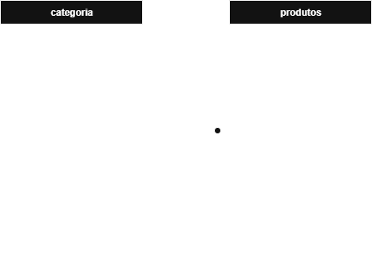

# 🏡 Atividades Assíncronas (para casa) 

## 1. Pesquisa sobre SGBDs Pesquisar outros SGBDs além do PostgreSQL (MySQL, Oracle, SQL Server, SQLite) e escrever 1 parágrafo sobre um deles, incluindo: 
- Principais características 
- Casos de uso típicos 
- Vantagens e desvantagens 

<br>

## 2. Script SQL Prático Criar um script SQL completo com: 
- Criação de 2 tabelas relacionadas (ex: produtos e categorias)

```sql
CREATE TABLE categoria (
    id SERIAL PRIMARY KEY,
    nome VARCHAR (50) UNIQUE NOT NULL,

    created_at TIMESTAMPTZ NOT NULL DEFAULT NOW(),
    updated_at TIMESTAMPTZ NOT NULL DEFAULT NOW()
);

CREATE TABLE produtos (
    id SERIAL PRIMARY KEY,
    categoria_id INT REFERENCES categoria(id) NOT NULL, -- referencia a PK da table categoria

    nome VARCHAR(50) NOT NULL,
    marca VARCHAR(50) NOT NULL,
    modelo VARCHAR(50) NOT NULL,
    UNIQUE (marca, modelo), -- unicidade composta, garante que o par marca e modelo sejam únicos
    
    n_serie VARCHAR(100) UNIQUE,
    
    preco NUMERIC(10,2) CHECK (preco >= 0) NOT NULL, -- garante casa decimal exata, com 10 dígitos no total, não pode ser negativo.
    
    estoque INTEGER CHECK (estoque >= 0) DEFAULT 0, -- iniciar o estoque com 0 e não pode ser negativo

    created_at TIMESTAMPTZ NOT NULL DEFAULT NOW(), -- registra o cadastro com dados completos, bom para registro interno com data e hora
    updated_at TIMESTAMPTZ NOT NULL DEFAULT NOW()  -- registra atualizações do cadastro, usando recurso que já interpreta o fuso local da máquina.
);
```

- Inserção de pelo menos 5 registros em cada tabela 

```sql
INSERT INTO categoria (nome)
VALUES 
    ('Eletronico'),
    ('Eletrodomestico'),
    ('Mobiliario'),
    ('Brinquedos'),
    ('Livros');

INSERT INTO produtos (categoria_id, nome, marca, modelo, n_serie, preco, estoque)
VALUES
    ((SELECT id FROM categoria WHERE nome = 'Eletronico'), 
        'Notebook Lenovo IdeaPad 3', 'Lenovo', 'IdeaPad 3', 'NB12345', 3500.00, 10),
    
    ((SELECT id FROM categoria WHERE nome = 'Eletronico'),
        'Smartphone Samsung Galaxy S20', 'Samsung', 'Galaxy S20', 'SM54321', 2500.00, 25),

    ((SELECT id FROM categoria WHERE nome = 'Eletrodomestico'),
        'Geladeira Brastemp Frost Free 375L', 'Brastemp', 'BRM44HK', 'ED001', 3200.00, 5),

    ((SELECT id FROM categoria WHERE nome = 'Mobiliario'),
        'Mesa de Jantar 4 lugares', 'Mobly', 'Mesa MDF', 'MB001', 1200.00, 8),

    ((SELECT id FROM categoria WHERE nome = 'Brinquedos'),
        'Quebra-Cabeça 500 Peças Paisagem', 'Grow', 'Puzzle500', 'BQ001', 70.00, 25),

    ((SELECT id FROM categoria WHERE nome = 'Livros'),
        'Use a Cabeça! SQL', 'Novatec', '1ª Edição', 'LV001', 120.00, 12);

```


- 3 consultas diferentes usando WHERE 

```sql
SELECT id, nome, preco 
FROM produtos 
WHERE marca = 'Lenovo' AND modelo = 'IdeaPad 3';

SELECT id, nome, marca, modelo, preco
FROM produtos
WHERE preco > 1000;

SELECT id, nome, marca, modelo, preco
FROM produtos
WHERE marca = 'Samsung';
```

- 1 consulta com ORDER BY 

```sql
SELECT id, nome, marca, modelo, preco
FROM produtos
ORDER BY preco DESC;
```

- 1 consulta com JOIN 

```sql
SELECT
    prod.id,
    prod.nome,
    prod.marca,
    prod.modelo,
    prod.preco,
    cat.nome AS categoria
FROM produtos prod
JOIN categoria cat ON cat.id = prod.categoria_id
ORDER BY cat.nome, prod.nome;
```

- Comentários explicando cada seção

*Na primeira sessão ocorre a criação das tables relacionadas e que serão futuramente populadas. Nela são atribuídos os campos/dados de cada table.*

*Tabela "categoria" seria a "tabela pai", com a lista controlada por categoria. Já a tabela "produtos" seria a "tabela filha" que referencia a categoria através da FK - FOREIGN KEY.*

*Na segunda sessão ocorre a atribuição dos valores para cada table, populando todos os campos. Vale ressaltar que os campos created_at e updated_at dependem de um trigger para inserir a informação no momento da ceiação/edição.*

*Na terceira sessÃo são feitas as consultas através de WHERE, indicando onde um determinado dado ou conjunto de dados deve ser buscado. E na quarta sessÃo é feito o ORDER BY, que ordena a busca de acrodo com o que for passano na sequência.*

<br>

## 3. Modelagem de Sistema Escolher um sistema simples (ex: escola, loja, hospital) e: 
- Desenhar as tabelas necessárias
- Definir os relacionamentos 
- Identificar chaves primárias e estrangeiras 




- Justificar as escolhas de tipos de dados 

*Na tabela de `categoria`, usei um campo inteiro auto para o `id`, porque é simples, rápido e facilita nos relacionamentos. O nome ficou como `VARCHAR(50)`, já que os nomes de categoria são curtos e não precisam de texto livre. Incluí também `created_at` e `updated_at` com `TIMESTAMPTZ`, porque, além da data acho relevante registrar a hora de acordo com o fuso para registros, o que ajuda a ter rastreabilidade/auditoria melhor.*

*Na tabela de `produtos`, mantive a mesma lógica para o `id` e coloquei `categoria_id` como chave estrangeira, também inteiro, para conectar com a tabela de `categorias`. Para nome, marca e modelo, usei `VARCHAR(50)`, suficiente para informações de identificação. O número de série virou `VARCHAR(100)`, já que fabricantes costumam misturar letras e números. O preco foi definido como `NUMERIC(10,2)`, para que o valor do produto tenha maior precisão, sem que sofra arredondamentos de ponto flutuante, além disso, está setado para receber até 10 digitos, 8 antes da vírgula e 2 após a vírgula. O estoque ficou como `INTEGER`, pois é uma contagem simples, e ainda adicionei restrições para não permitir números negativos (>=0). Por fim, também usei `created_at` e `updated_at` com `TIMESTAMPTZ`, garantindo que o sistema sempre registre quando o dado foi criado ou alterado.* 

<br>

## 4. Leitura Complementar Ler o capítulo introdutório do livro *Use a Cabeça! SQL* ou artigos do W3Schools sobre SQL. 

<br>

## 5. Reflexão Crítica Escrever um texto de 1 página sobre: "Quando usar SQL/Banco de Dados vs. Planilha Excel? Quais as vantagens e limitações de cada abordagem?" 

<br>

## 6. Prática com Dataset Real Baixar um dataset público simples (CSV) e: 
- Importar para PostgreSQL 
- Criar 5 consultas diferentes 
- Documentar insights encontrados

