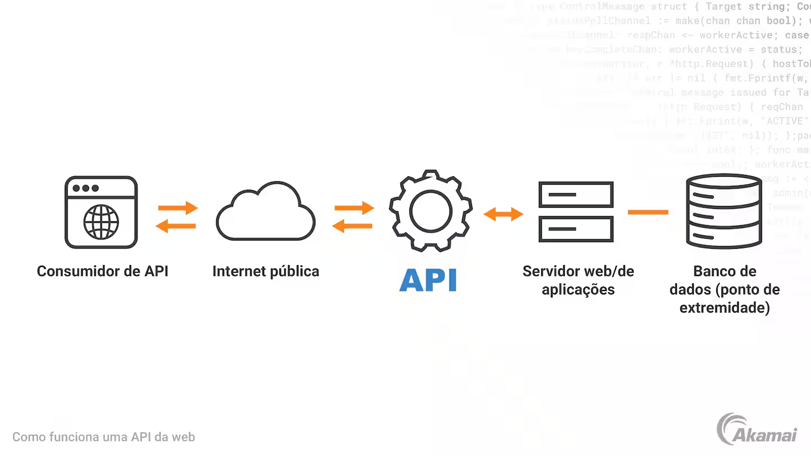
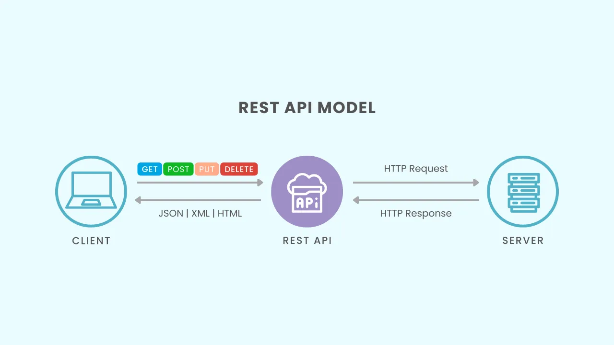
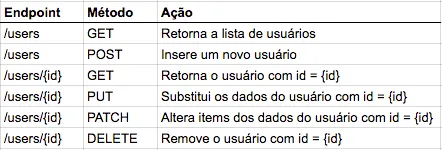

# API

## O que é e para que serve

### O que é?
**A**pplication <br>
**P**rograming <br>
**I**nterface <br>

**API** é uma interface que permite comunicação etre sistemas diferentes.



<br>




### Por que usar API?
- Integração entre sistemas;
- Reutilização de funcionalidades
- Aplicações modulares e escaláveis
- Base das aplicações web modernas

<br>

> <br>
> API geralmente é utilizada em microsserviços, sendo a forma como essas partes de uma aplicação consigam trocar informações entre si e entre outros serviços.
> 
> <br>

<br>

## O que é REST?
**Re**presetational <br>
**S**tate <br>
**T**ransfer <br>

**REST** é um estilo de arquitetura para a construção de serviços web.

- Representação de estado de referência
    ```js
    GET /usuarios/123       // → Busca usuário 123
    POST /usuarios          // → Cria novo usuário
    PUT /usuarios/123       // → Atualiza usuário 123
    DELETE /usuarios/123    // → Remove usuário 123
    ```
    _Não utilizar **POST** para atualizar um usuário, pois ao utilizar, estará criando um novo objeto e não atualizado um existente. Sendo assim, o método correto para atualizar um usuário é **PUT**_
<br>

### Princípios REST:
- Cliente-Servidor (consumidor/fornecedor) → separação clara de responsabilidade;
- Stateless → sem memória entre requisições, se necessário for, utilizar estratégia de cache;
- Interface Uniforme → uso padronizado de HTTP;
- Recursos → tudo é acessível via URL (end-point);

<br>

## Métodos HTTP

O protocolo **HTTP** define métodos, referidos como verbos para indicar a ação desejada a ser realizada no recurso identificado. O que este recurso representa, se são dados pré-existentes ou dados gerados dinamicamente, depende da implementação do servidor. (_fonte [Wikipedia](https://en.wikipedia.org/wiki/Hypertext_Transfer_Protocol#Request_methods)_)

<br>

Método | Ação | Exemplo
:----- | :--- | :------
GET | Buscar | `GET /produtos`
POST | Criar | `POST /produtos`
PUT | Atualizar compelto | `PUT /produtos/1`
PATCH | Atualizar parcial | `PATCH /produtos/1`
DELETE | Remover | `DELETE /produtos/1`

<br>



<br>

## Códigos de Status HTTP

<br>

Código | Categoria | Significado
:----- | :-------- | :----------
`200 Ok` | Sucesso | Tudo certo
`201 Create` | Sucesso | Recurso criado
`204 No Content` | Sucesso | Sucesso sem retorno
`400 Bad Request` | Erro do Cliente | Dados inválidos
`404 Not Found` | Erro do Cliente | Não encontrado
`401 Unauthorized` | Erro do Cliente | Não autenticado
`500 Internal Server Error` | Erro do Servidor | Erro interno

<br>

_[HTTP Cats](https://http.cat/) é um site que associa os diferentes códigos de status HTTP a imagens de gatos._

## Anatomia de uma requisição HTTP
```js
GET /api/usuarios/123 HTTP/1.1  // método
Host: meusite.com               // endpoint
Content-Type: application/json  // header
Authorization: Bearer token123  // body

{
  "filtro": "ativo"
}
```

<br>

- Método: GET
- Endpoint: /api/usuarios/123
- Headers: Metadados (tipo de conteúdo, autenticação)
- Body: Dados enviados (opcional, geralmente não usado em GET)

<br>

## Por que FAST API?
Framework moderno para APIs: produtividade, desempenho e padrões modernos