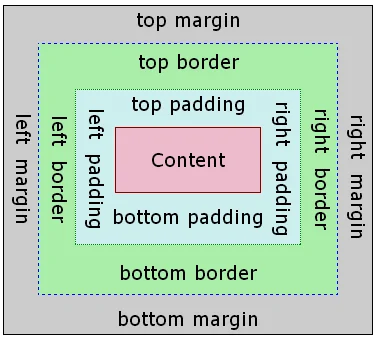

# Front Descomplicado: HTML & CSS

## HTML
_HTML é a linguagem de marcação padrão para páginas da Web, não podendo ser considerada uma linguagem de programação, uma vez que não manipula os recursos do hardware_

### Estrutura base de um HTML
1. Indica a versão do HTML → `<!DOCTYPE html>`
2. Estrutura as informações base, como meta dados e estilização via css → `<head></head>`
3. Estrutura o corpo do site, podendo conter a indicação do scrip que irá integrar o código → `<body></body>`

```html
<!DOCTYPE html>
<head>
    ...
</head>
<body>
    ...
</body>
<script>
    ...
</script>
```

<br>

### Tags HTML
- Tags que podem conter filhos
```html
<h1>
    child (texto etc...)
</h1>
```

<br>

- Tags independentes, que não possuem filhos (sem conteúdo interno), mas recebem atributos de configuração
```html

```

<br>

### Estrutura de um site HTML padrão
```html
<!DOCTYPE html>
<head>
    ...
</head>
<body>
    <main>

    </main>
</body>
<script>
    ...
</script>
```

<br>

## CSS
_**C**ascading **S**tyle **S**heets. O CSS é a linguagem que usamos para estilizar um documento HTML. Ele descreve como os elementos HTML devem ser exibidos._

### Design Token
Com a versão atual, CSS3, é possível utilizar variáveis a fim de reaproveitar padrões em vários momentos do código. Esse documento poderá estar separado e ser importando nos momentos necessários. 

> _Grid 8pts - multiplos de 4, sendo 4 o menor_

### Formas de utilização CSS
- CSS externo → um arquivo externo `style.css`

<br>

#### Estrutura de um CSS
Todo CSS tem uma regra:
```css
* {
    reset: all;
}

seletor {
    chave: valor
}
```

#### Tipos de seletor
1. Seletor de tag
```css
main {
    background: pink;
}
```

2. Seletor de class
```css
.center {
    text-align: center;
    color: red;
}
```

3. Seletor de id
```css
#unico {
    text-align: center;
    color: red;
}
```

#### Aninhamento de seletores
```css
main {
    .center {
        text-align: center;
        color: red;
    }
}
```

### Box Model
_Modelo para trabalhar com as três dimensões do site, ou seja, sobre as seguintes propriedades: `margin`, `padding` e `border`_

```bash
┌─────────────────── margin ───────────────────┐
│ ┌───────────────── border ─────────────────┐ │
│ │ ┌─────────────── padding ──────────────┐ │ │
│ │ │                                      │ │ │
│ │ │          CONTENT                     │ │ │
│ │ │         (width × height)             │ │ │
│ │ │                                      │ │ │
│ │ └──────────────────────────────────────┘ │ │
│ └──────────────────────────────────────────┘ │
└──────────────────────────────────────────────┘
```


1. `margin` → espaço ao redor dos elementos. Deixa uma área livre além da borda. 
2. `padding` → cria uma área livre ao redor do conteúdo.
3. `border` → uma borda que circunda o preenchimento e o conteúdo.

<br>

_Exemplo_<br>


<br>

### Display
_A `display` propriedade especifica o comportamento de exibição (o tipo de caixa de renderização) de um elemento._
<br>

[Display Flex tutorial](https://origamid.com/projetos/flexbox-guia-completo/)

<br>

### Media Queries
_As **media queries** do CSS permitem aplicar estilos com base nas características do dispositivo ou do ambiente que exibe a página da web, sendo essenciais para a criação de páginas web responsivas._

```css
@media(max-width:700px){
    .container {
        display: flex;
        flex-direction: column;
    }
}
```

<br>

### Frameworks CSS
_Frameworks CSS são bibliotecas pré-construídas que fornecem componentes prontos, sistemas de grid e utilitários, acelerando o desenvolvimento._

#### Bootstrap
_O [Bootstrap Framework](https://getbootstrap.com.br/) utilitário para css, introduz componentes para serem reutilizados no site_
